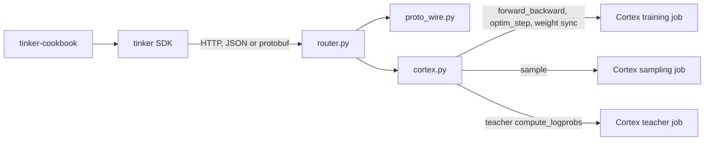
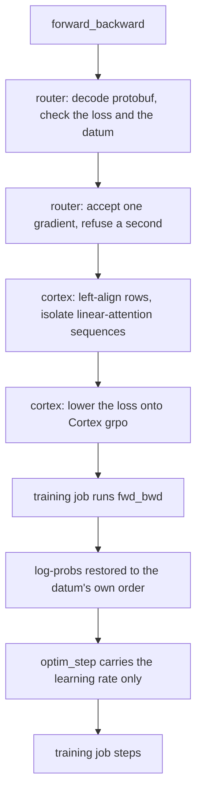

# Tinker integration

This integration serves Tinker's HTTP API over Cortex Training. Compatible
`tinker-cookbook` recipes run unchanged except for configuration such as
`TINKER_BASE_URL`, model, and training parameters.

Validated with `tinker==0.25.0` and `tinker-cookbook==0.5.5`.

## Request path

`serve.py` creates the Cortex jobs and registers handlers on `router.py`. The router speaks Tinker's HTTP API and does not import the Cortex client. `serve.py` and `cortex.py` call the published `arctic-platform` package; they do not vendor it.



`forward` has no handler, so the router returns 400 before any Cortex call. A training request that is still running after 30 seconds is answered as a future; the SDK polls `retrieve_future` instead of sending the work again.

One optimizer step:



Sampling and distillation take the other jobs. `sample` is checked for temperature 1.0, then generated on the sampling job. A teacher named at startup is a second sampling job; `compute_logprobs` reads its prompt log-probs and does not generate.

## Install

```bash
pip install "cortex-training[tinker]"
pip install "tinker==0.25.0" "tinker-cookbook[math-rl]==0.5.5"
```

`cortex-training[tinker]` depends on `arctic-platform[cortex]` from PyPI. That package is the only Arctic Platform code this server imports.

The server is CPU-only. Cortex runs the training and sampling workers.

## Configure Cortex

```bash
export ARCTIC_CORTEX_HOST=<account>.<region>.snowflakecomputing.com
export ARCTIC_CORTEX_DATABASE=<db>
export ARCTIC_CORTEX_SCHEMA=<schema>
export ARCTIC_CORTEX_PAT=<your PAT>
```

The account needs:

- an existing database and schema
- a Snowflake PAT
- quota for both the training and sampling sub-jobs

A job can remain in `PLACING` while it waits for GPU capacity.

## Start the server

```bash
python -m cortex_training.tinker.serve \
    --model Qwen/Qwen3-0.6B \
    --training-gpus 1 \
    --sampling-gpus 1 \
    --max-prompt-length 1024 \
    --max-response-length 512 \
    --zero-stage 2 \
    --port 8112
```

Check readiness:

```bash
curl -s http://127.0.0.1:8112/api/v1/get_server_capabilities
```

Use `--job-id <id>` to attach to an existing Cortex job. The server releases
jobs it creates when it shuts down; attached jobs remain running.

On-policy distillation samples a teacher with
`create_sampling_client(base_model=...)` and scores the student's rollouts with
`compute_logprobs`. Start the server with the teacher as well:

```bash
python -m cortex_training.tinker.serve \
    --model Qwen/Qwen3.5-9B-Base \
    --teacher-model Qwen/Qwen3.5-9B \
    --teacher-sampling-gpus 2 \
    ...
```

The teacher runs from its base weights as a sampling-only Cortex job of its
own, created and released with the server. A sampler for a model that is
neither the trained model nor the teacher returns 400.

## Run a cookbook recipe

```bash
TINKER_API_KEY=tml-dummy python -m tinker_cookbook.recipes.math_rl.train \
    base_url=http://127.0.0.1:8112 \
    model_name=Qwen/Qwen3-0.6B \
    renderer_name=qwen3_disable_thinking \
    lora_rank=0 \
    env=gsm8k \
    group_size=8 \
    groups_per_batch=8 \
    max_tokens=384 \
    temperature=1.0 \
    learning_rate=2e-6 \
    save_every=0 \
    eval_every=0
```

Required settings:

- `TINKER_API_KEY` must start with `tml-`; the value is otherwise unused.
- Set `renderer_name` explicitly for models absent from the cookbook's
  recommendation table.
- Use the recipe's `lora_rank` as the server's `--lora-rank` (see below).
- Use `temperature=1.0`.
- Keep `max_tokens < --max-response-length`.
- Ensure rendered prompts fit `--max-prompt-length`.
- Use `save_every=0` unless acknowledgment-only saves are acceptable.

Training rows are never truncated. A prompt or response longer than its limit
is accepted as long as the whole datum fits
`--max-prompt-length + --max-response-length`; a longer datum returns 400.

### LoRA and the optimizer

The adapter and the optimizer are part of the Cortex job, so the server fixes
them at start-up:

- `--lora-rank N` trains a LoRA adapter of rank `N` with `--lora-alpha`
  (default `32`, Tinker's) on `--lora-modules` (default `mlp,attn,unembed`,
  Tinker's default `train_mlp`, `train_attn`, and `train_unembed`). Weight sync
  sends only the adapter. `--lora-rank 0` (the default) is full fine-tuning.
- Adam uses `--adam-beta1 0.9 --adam-beta2 0.95 --adam-eps 1e-8
  --weight-decay 0 --grad-clip-norm 0`, the values the cookbook sends.

A training client whose LoRA rank or modules differ from the server's, or an
`optim_step` whose Adam settings differ, returns 400 naming the flag to change.
The learning rate is applied per step.

The cookbook's default learning rate is intended for LoRA. Full fine-tuning
may require a lower learning rate.

## Supported scope

Supported:

- text-only full fine-tuning and LoRA
- `ppo`, `importance_sampling`, and `cross_entropy`, with the importance
  ratio taken against the sampler's log-probs; `ppo` accepts
  `clip_low_threshold` and `clip_high_threshold` in `loss_fn_config`
- sampling, forward-backward, optimizer step, and sampler weight sync
- client-defined custom losses through `forward_backward_custom`, on backends
  that serve `forward` (not Cortex; see below)
- on-policy distillation from one teacher, including `compute_logprobs`

Current limitations:

| Limitation | Behavior |
|---|---|
| LoRA | One rank and module set per server, fixed at start-up; others return 400. |
| Temperature | Sampling temperatures other than `1.0` return 400. |
| Checkpoints | `save_weights` returns an acknowledgment path; load and resume are not implemented. |
| Sequence limits | A datum longer than `--max-prompt-length + --max-response-length` returns 400. |
| Loss config | `loss_fn_config` keys other than PPO's two clip thresholds return 400. |
| Forward | `forward` (log-probs without gradients) returns 400: Cortex's no-gradient pipeline rejects this request shape. `forward_backward` returns the same log-probs. The cookbook's NLL evaluator uses `forward`, so run `chat_sl` with `eval_every=0`. `forward_backward_custom` calls `forward` first, so custom losses (DPO, SDFT) are unavailable on Cortex. |
| Gradient accumulation | Cortex steps on the last `forward_backward`'s gradient and drops earlier ones, where Tinker sums them. A second `forward_backward` before `optim_step` therefore returns 400. In the cookbook, leave `stream_minibatch_config` unset or use `num_minibatches=1`; `num_substeps` is unaffected. |
| Teacher | One teacher, from its base weights. A teacher checkpoint (the distillation recipe's `teacher_checkpoint`) and `topk_prompt_logprobs` return 400. |
| Base-model samplers | `create_sampling_client(base_model=...)` for the trained model reads its untrained weights, which the sampler holds only until the first weight sync; after that it returns 409. |
| Optimizer overrides | Only the learning rate varies per step; other Adam settings are fixed at start-up. |
| Multimodal input | Only encoded text tokens are passed to Cortex. |
| Authentication | The local Tinker server does not authenticate requests. |

Recipes that require audio, images, checkpoint resume, reference-model
workers, external tools, or external graders are not covered by this
integration.

## Protocol notes

Current Tinker SDKs use protobuf for:

- `forward_backward` requests
- `ForwardBackwardOutput` responses
- `SampleResponse` responses

Sample requests remain JSON. The codec uses the SDK's generated
`tinker_public_pb2` schema.

The adapter also handles three tensor conventions:

- Tinker rows contain left prompt padding; Cortex expects valid tokens in
  leading columns. The Cortex binder aligns rows before the request and restores
  the original order in returned log-probs.
- The final `target_tokens` item is appended as a scoring token. It is excluded
  from the response mask and advantages.
- Cortex refuses a batch with fewer rows than training GPUs. Short batches are
  padded with copies of a row that carry no loss, and the copies are dropped
  from the returned log-probs.

It also works around three SDK and Cortex behaviors:

- The SDK resends any request that takes over 60 seconds. Work still running
  after 30 seconds is answered with its future and finishes in the background,
  so a slow forward-backward or optimizer step is never run twice. Work on the
  trained model runs one request at a time, in arrival order.
- The SDK splits a large `forward_backward` into 5 MB requests, and Cortex keeps
  only the last one's gradient. The server's client config raises the SDK's
  chunk limits so each batch arrives as one request.
- Cortex packs several sequences into one micro-batch. Models with linear
  attention layers (Qwen3.5's Gated DeltaNet) carry state across sequence
  boundaries in Cortex's Hugging Face provider, which corrupts every sequence
  after the first in a pack. For these models (`--isolate-sequences auto`, the
  default) the server provisions micro-batches of one full-length datum and
  extends each row with loss-free tokens past half that length, so no two rows
  share a micro-batch. This costs throughput on short rows. Remove it once
  Cortex resets linear-attention state at packed boundaries.

## Custom losses

`forward_backward_custom` computes a loss in the SDK and sends
`dC/dlogprobs` as per-token weights. The adapter maps this to Cortex `grpo` with:

- `advantages = -weights`
- no old log-probs, making the importance ratio `1`
- `batch_num_tokens = 1`

This preserves the client loss gradient. Server-side loss and entropy metrics
on this path do not represent the client's loss or model entropy.

## Validation

Live validation covered `math_rl`, `chat_sl`, and `rl_loop` with importance
sampling, PPO, and cross-entropy. Detailed results are recorded in the PR.

Trainer parity with Tinker was measured by sampling rollouts on Tinker once and
replaying the same datums on Tinker and on this adapter for five steps, both
training the same LoRA with the cookbook's Adam settings. The convergence
recipes were re-run for ten steps against runs made before the packing,
chunking, and resend fixes:

| Recipe | Model | Setup | Result |
|---|---|---|---|
| `math_rl` GSM8K, parity | Qwen3.5-4B | LoRA rank 32, lr `1e-5`, 5 steps, same datums on both | Loss `0.01025 → 0.00889` (Tinker) and `0.01029 → 0.00891` (Cortex); per-token log-prob gap `0.004` |
| On-policy distillation, parity | Qwen3.5-4B, teacher Qwen3.5-9B | LoRA rank 128, lr `1e-4`, 5 steps, same datums on both | Loss `0.0733 → -0.3395` (Tinker) and `0.0728 → -0.3517` (Cortex); teacher log-prob gap `0.0096` |
| On-policy distillation, parity | Qwen3.5-4B, teacher Qwen3.6-35B-A3B | LoRA rank 32, lr `1e-4`, 16 rollouts, 4,096 tokens, 5 steps, same datums on both. Both models are in the Cortex training catalog. The teacher scored the sample on Tinker | Loss `0.211 → -2.973` (Tinker) and `0.211 → -3.095` (Cortex); per-token log-prob gap `0.018`; drift `-0.241` / `-0.238` |
| On-policy distillation, GSM8K | Qwen3.5-4B, teacher Qwen3.6-35B-A3B | LoRA rank 32, lr `1e-4`, 16 rollouts, 3,915 tokens, 5 steps | Tinker loss `0.132 → -0.158`. Cortex did not train: the 1-GPU job failed `placement_timeout` twice |
| On-policy distillation, MATH | Qwen3.5-4B, teacher Qwen3.6-35B-A3B | LoRA rank 32, lr `1e-4`, 16 rollouts, 4,096 tokens, 5 steps | Tinker loss `0.165 → -0.714`. Cortex did not train: same `placement_timeout` |
| `math_rl` GSM8K, convergence | Qwen3.5-9B | Full fine-tuning, lr `2e-6`, 64 groups of 8, 10 steps | Accuracy at step 9 `0.926` before the fixes, `0.951` after; `kl_sample_train_v1` `0.023`–`0.040` before, `0.0001`–`0.0003` after |
| `math_rl` MATH, convergence | Qwen3.5-9B | Full fine-tuning, lr `1e-6`, 64 groups of 16, 10 steps | Accuracy at step 9 `0.098` before the fixes, `0.307` after; `kl_sample_train_v1` about `0.019` before, `0.0002` after |

Keeping one sequence per micro-batch on Qwen3.5 makes a step slower: about
125 s instead of 75 s for GSM8K, and 252 s instead of 100 s for MATH.

For RL runs, `kl_sample_train_v1` checks agreement between sampler and trainer
log-probs. In the parity runs it started at `0.0002`–`0.0004` on both
backends. A value far above that from the first step, or one that keeps
rising without learning, points to a request-shape, alignment, or packing
problem.

## Tests

```bash
pip install -e ".[testing]"
pytest -q tests/integrations/tinker
```

The tests cover API endpoints, request schemas, protobuf conversion, datum
packing, Cortex lowering, row alignment, custom-loss gradients, and error
handling. They do not require a Cortex account or GPU.

## Troubleshooting

| Error | Action |
|---|---|
| `The api_key must start with the 'tml-' prefix` | Set `TINKER_API_KEY=tml-dummy`. |
| `KeyError` from `get_recommended_renderer_name` | Pass `renderer_name` explicitly. |
| `Server returned a JSON payload ... only supports as proto` | Confirm the protobuf response path is installed and active. |
| `cortex ... returned no per-token log-probs` | Check the Cortex response shape and configured post-processor. |
| `packing requires left-aligned rows` | Confirm requests pass through the Cortex binder. |
| Job remains in `PLACING` | Check account GPU capacity and quota. |
| `429 ... GPU cap reached` | Release an existing job and retry after cancellation completes. |

## Files

| File | Role |
|---|---|
| `router.py` | Tinker API routes, sessions, futures, and datum conversion |
| `proto_wire.py` | Tinker protobuf request and response codec |
| `cortex.py` | Cortex request lowering and tensor alignment |
| `serve.py` | Cortex job provisioning and ASGI server |
